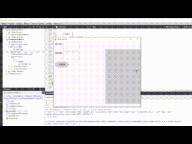

[TOC]

## 开发环境

`Qt版本: ` 6.5.3

`构建: `cmake + minGW64-bit

## 简介

这是一个纯QML程序，功能是一个消息列表的功能，可以进行插入，删除，清空等操作

## 预览图



## 如何使用
直接导入messageQueueView文件夹即可
## 代码

这里的代码只包括组件的代码，不包括整个项目的代码。

`结构如下:`

``` txt
- messageQueueView
  - resource
    - Background.qml
    - MessageView.qml
    - ScroolBar.qml
  - MessageQueueView.qml
```

`Background.qml: ` 消息队列的背景

`MessageView.qml: ` 显示插入的消息

`ScroolBar.qml: ` 滑块

`MessageQueueView.qml: `消息队列组件

### main.qml

展示消息列表组件功能

``` qml
import QtQuick
import QtQuick.Controls
import QtQuick.Controls.Material
import "./messageQueueView"

Window {
    width: 640
    height: 480
    visible: true
    title: qsTr("Hello World")

    Item {
        id: root
        width: parent.width
        height: parent.height
        Pane {
            width: parent.width
            height: parent.height
            Column {
                width: 80
                height: 100
                spacing: 10
                Material.theme: Material.System
                Row {
                    Text {
                        text: "插入消息:  "
                    }
                    TextField {
                        Keys.onReturnPressed: {
                            messageQueueView.insert(text,{
                                                     title: "这是一个消息的标题",
                                                     message: "这是第 " + messageQueueView.count +" 条消息"
                                                 })
                        }
                    }
                }
                Row {
                    Text {
                        text: "移除消息:  "
                    }
                    TextField {
                        Keys.onReturnPressed: {
                            messageQueueView.remove(text,1)
                        }
                    }
                }
                Row {
                    Button {
                        text: "清空消息"
                        onClicked: {
                            messageQueueView.clear()
                        }
                        Keys.onReturnPressed: {
                            messageQueueView.model.clear()
                        }
                    }
                    Button {
                        text: "打开"
                        onClicked: {
                            messageQueueView.show()
                        }
                        Keys.onReturnPressed: {
                            messageQueueView.show()
                        }
                    }
                    Button {
                        text: "关闭"
                        onClicked: {
                            messageQueueView.hide()
                        }
                        Keys.onReturnPressed: {
                            messageQueueView.hide()
                        }
                    }
                }


            }
        }

        MessageQueueView {
            id: messageQueueView
            anchors.right: parent.right
            anchors.bottom: parent.bottom
            anchors.bottomMargin: 20
            Component.onCompleted: {

            }
        }
    }
    Timer {
        property var data: [
            {
                title: "这是一个消息的标题",
                message: "这是一个消息,这是一个消息,这是一个消息,这是一个消息,这是一个消息,这是一个消息,这是一个消息"
            },
            {
                title: "这是一个消息的标题",
                message: "这不是一个消息，这不是一个消息，这不是一个消息，这不是一个消息，这不是一个消息，这不是一个消息"
            },
            {
                title: "这是一个消息的标题",
                message: "好吧，这是一一一条消息"
            },
        ]
        property int current: 0
        interval: 400
        onTriggered: {
            if(current < data.length) {
                messageQueueView.insert(0,data[current]);
                current ++;
                start();
            }
        }
        Component.onCompleted: {
            start()
        }
    }
}

```

### MessageView.qml

消息列表组件

``` qml
import QtQuick 2.15

/*
    消息视图
*/
ListView {
    id: listview

    width: content.width
    height: content.height
    spacing: 10
    anchors.horizontalCenter: parent.horizontalCenter
    verticalLayoutDirection: ListView.BottomToTop
    clip: true
    model: root.model

    delegate: messageItemDelegate
    // add 添加 过渡动画 因add导致被影响的项
    add: Transition {
        id: addTrans
        onRunningChanged: {
//            console.log("addTran: " + ViewTransition.item)
        }
        ScriptAction { // 动态添加一个定时器 延时设置透明度
            script: {
                addDelayHide(addTrans.ViewTransition.item)
            }
        }
        ParallelAnimation {
            NumberAnimation {
                property: "opacity"
                from: 0
                to: 1
                duration: 300
                easing.type: Easing.InOutQuad
            }
            PathAnimation {
                duration: 400
                easing.type: Easing.InOutQuad
                path: Path {
                    startX: addTrans.ViewTransition.destination.x + 80
                    startY: addTrans.ViewTransition.destination.y
                    PathCurve {
                        x: (listview.width - addTrans.ViewTransition.item.width) / 2
                        y: addTrans.ViewTransition.destination.y
                    }
                }
            }
        }


    }
    // add 添加 过渡动画
    addDisplaced: Transition {
        id: dispTran
        onRunningChanged: {
            if(running) {
//                console.log("addDispTran: " + ViewTransition.targetItems)
            }
        }
        // 如果数据插入太快会导致动画被中断 然后动画控制的属性值无法回到正确的值，在这里手动回到正确的值
        ScriptAction {
            script: {
                let item = dispTran.ViewTransition.item
                if(root.state === "show") {
                    item.opacity = 1
                }
                if(root.state === "hide" && item.state === "NONEW") {
                    item.opacity = 0
                    console.log(item.children)
                }
            }
        }
        PropertyAction { property: "x"; value: (listview.width - dispTran.ViewTransition.item.width) / 2;}

        NumberAnimation {
            property: "y"
            duration: 300
            easing.type: Easing.InOutQuad
        }

    }

    // remove 移除 过渡动画
    remove: Transition {
        id: removeTran
        onRunningChanged: {
//            console.log("removeTran: " + ViewTransition.targetItems)
        }
        ParallelAnimation {
            NumberAnimation {
                property: "x"
                to: listview.width
                duration: 400
                easing.type: Easing.OutQuart
            }
            NumberAnimation {
                property: "opacity"
                from: 1
                to: 0
                duration: 400
                easing.type: Easing.InOutQuart
            }
        }


    }
    // remove 移除 过渡动画 因romove导致被影响的项
    removeDisplaced: Transition {
        id: removeDispTran
        onRunningChanged: {
//            console.log("removeDispTran: " + ViewTransition.targetItems)
        }
        ParallelAnimation {
            NumberAnimation {
                property: "y"
                duration: 500
                easing.type: Easing.InOutQuart
            }
        }
    }

    // populate 委托项加载时触发
    populate: Transition {
        id: popuTran
        NumberAnimation {
            property: "opacity"
            duration: 300
            from: 0
            to: 1
            easing.type: Easing.OutCubic
        }
    }
    // 视图滑块
    ScroolBar.vertical: ScroolBar {

    }
    /*
        消息视图显示时 使所有加载项显示
        消息视图隐藏时 使所有加载项隐藏
    */
    Connections {
        target: root
        function onStateChanged() {
            for(let i = 0; i < contentItem.children.length;i++) {
                let item = contentItem.children[i]
                if(root.state === "show") {
                    item.opacity = 1
                } else if(root.state === "hide"){
                    item.opacity = 0
                }
            }
        }
    }

    /*
        添加延时定时器
        如果视图隐藏时，只显示新添加的消息
    */
    function addDelayHide(item) {
        if(root.state === "show") return

//        let item = contentItem.children[contentItem.children.length-1]
        let timer = Qt.createQmlObject("
                            import QtQml
                            Timer {}
        ",item)
        let callBack = () => {
            if(root.state === "show") return
            timer.parent.opacity = 0
            timer.parent.state = "NONEW"
            console.log("timer: " + timer.parent)
        }

        timer.interval = 3000
        timer.triggered.connect(callBack)
        timer.start()
    }

}


```

### Background.qml

背景

```qml
// Background.qml
import QtQuick 2.15
/*
    背景
*/
Loader {
    id: backgroundLoader
    anchors.fill: parent
    sourceComponent: root.background
}

```

### ScroolBar.qml

滑块

``` qml
// ScrollBar.qml
import QtQuick 2.12
import QtQuick.Controls 2.12
import QtQuick.Controls.impl 2.12
import QtQuick.Templates 2.12 as T

/*
    滑动条
*/
T.ScrollBar {
    id: control

    property color handleNormalColor: "#7FFFFFFF"  //按钮颜色
    property color handleHoverColor: Qt.lighter(handleNormalColor,1.1)
    property color handlePressColor: Qt.darker(handleNormalColor,1.1)

    property real handleWidth: 10
    property real handleHeight: 10
    implicitWidth: Math.max(implicitBackgroundWidth + leftInset + rightInset,
                            implicitContentWidth + leftPadding + rightPadding)
    implicitHeight: Math.max(implicitBackgroundHeight + topInset + bottomInset,
                             implicitContentHeight + topPadding + bottomPadding)

    padding: 1 //背景整体size和handle的间隔
    visible: control.policy !== T.ScrollBar.AlwaysOff

    contentItem: Rectangle {
        implicitWidth: control.interactive ? handleWidth : 2
        implicitHeight: control.interactive ? handleHeight : 2

        radius: width / 2
        color: if(control.pressed) return handlePressColor
               else if(control.hovered) return handleHoverColor
               else return handleNormalColor
        // 超出显示范围显示滚动条
        opacity:(control.policy === T.ScrollBar.AlwaysOn || control.size < 1.0)?1.0:0.0

    }
}

```

### MessageQueueView.qml

使用此组件即可

``` qml
// MessageQueueView.qml
import QtQuick
import QtQuick.Controls
import Qt5Compat.GraphicalEffects
import "./resource"

Item {
    id: root


    property real margin: 20

    property Component messageItemDelegate: messageDelegate
    property Component background: backgourndCmp
    property ListModel model: ListModel {}

    property alias itemsSpacing: messageView.spacing
    property alias count: messageView.count

    signal added()
    signal removed()

    width: 260
    height: 400

    state: "show"
    states: [
        State {
            name: "hide"
            PropertyChanges {
                target: content
                opacity: 0
                x: root.width
            }
            PropertyChanges {
                target: showIcon
                parent: root
                anchors.right: content.left
                anchors.verticalCenter: content.verticalCenter
            }
            PropertyChanges {
                target: messageView
                interactive: false
            }
        },
        State {
            name: "show"
            PropertyChanges {
                target: content
                opacity: 1
                x: 0
            }
            PropertyChanges {
                target: showIcon
                parent: root
                anchors.right: content.left
                anchors.verticalCenter: content.verticalCenter
            }
            PropertyChanges {
                target: messageView
                interactive: true
            }
        }
    ]
    transitions: [
        Transition {
            from: "hide"
            to: "show"
            SequentialAnimation {
                ScriptAction {
                    script: {
                        messageView.parent = content
                        console.log("AA")
                    }
                }
                ParallelAnimation {
                    NumberAnimation {
                        target: content
                        property: "x"
                        duration: 400
                        easing.type: Easing.OutCubic
                    }
                    NumberAnimation {
                        target: content
                        property: "opacity"
                        duration: 400
                        easing.type: Easing.InOutQuad
                    }
                }
            }

        },
        Transition {
            from: "show"
            to: "hide"
            SequentialAnimation {
                ParallelAnimation {
                    NumberAnimation {
                        target: content
                        property: "x"
                        duration: 400
                        easing.type: Easing.OutCubic
                    }
                    NumberAnimation {
                        target: content
                        property: "opacity"
                        duration: 400
                        easing.type: Easing.InOutQuad
                    }
                }
                ScriptAction {
                    script: {
                        messageView.parent = root
                        console.log("AA")
                    }
                }
            }

        }
    ]


    // 主体内容
    Item {
        id: content
        z: 0
        width: parent.width
        height: parent.height
        // 背景加载
        Background {
            id: backgroundLoader
        }
        // 消息视图
        MessageView {
            id: messageView
        }
    }

    // 打开关闭按钮
    ColorImage {
        id: showIcon
        z: 4
        width: 20
        height: width
        rotation: 90
        source: "qrc:/images/downUp.svg"
        color: "#4F00FF00"
        MouseArea {
            anchors.fill: parent
            cursorShape: Qt.PointingHandCursor
            onClicked: {
                if(root.state === "show") {
                    root.hide()
                } else {
                    root.show()
                }
            }
        }
    }

    Component {
        id: backgourndCmp
        Rectangle {
           id: background
           anchors.fill: parent
           color: "#2F000000"
        }
    }

    // 单个消息委托
    Component {
        id: messageDelegate
        Rectangle {
            id: msgItem
            x: (messageView.width - width) / 2
            width: messageView.width - root.margin*2
            height: 80
            radius: 8
            opacity: 1
//            visible: opacity
            color: "#2F000000"
            clip: true

            Behavior on opacity {
                NumberAnimation {
                    property: "opacity"
                    duration: 400
                    easing.type: Easing.InOutQuad
                }
            }

            Row {
                width: parent.width - 20
                height: parent.height - 20
                spacing: 5
                anchors.centerIn: parent
                Image { // 消息图标
                    id: iconImg
                    width: 35
                    height: width
                    anchors.verticalCenter: parent.verticalCenter
                    source: iconSource
                }
                Column { // 消息信息
                    id: infoText
                    width: parent.width - iconImg.width - parent.spacing*2 - toolBar.width
                    height: parent.height
                    spacing: 5
                    Text {
                        property real maxHeight: parent.height * 0.3
                        width: parent.width
                        height: maxHeight
                        wrapMode: Text.Wrap
                        elide: Text.ElideRight
                        font.pointSize: 12
                        font.bold: true
                        text: title
                        color: "#FFFFFF"
                    }
                    Text {
                        property real maxHeight: parent.height * 0.7 - parent.spacing
                        width: parent.width
                        height: maxHeight
                        wrapMode: Text.Wrap
                        elide: Text.ElideRight
                        font.pointSize: 9
                        text: message
                        color: "#FFFFFF"
                    }
                }

                Column { // 工具栏
                    id: toolBar
                    width: 15
                    MouseArea {
                        width: parent.width
                        height: width
                        cursorShape: Qt.PointingHandCursor
                        Rectangle {
                            width: parent.width
                            height: 1
                            anchors.centerIn: parent
                            rotation: 45
                        }
                        Rectangle {
                            width: parent.width
                            height: 1
                            anchors.centerIn: parent
                            rotation: -45
                        }
                        onClicked: {
                            remove(index)
                        }
                    }
                }
            }
        }

    }


    function show() {
        root.state = "show"
    }

    function hide() {
        root.state = "hide"
    }

    function insert(index,info) {
        let title = info.title || "标题"
        let message = info.message || "信息"
        let iconSource = info.iconSource || "qrc:/images/message.svg"
        model.insert(index,{
                        title: title,
                        message: message,
                        iconSource: iconSource
                     })
        root.added()
    }

    function remove(index,count = 1) {
        model.remove(index, count)
    }

    function clear() {
        model.clear()
    }
}

```

